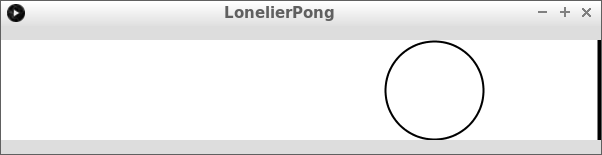

# LonelierPong

LonelierPong is a 1 player pong game, written in Processing.

The name and gameplay of `LonelierPong` is inspired on 
[Thijs van Beers](https://github.com/thijsvb)'
smash hit 
[LonelyPong](https://github.com/thijsvb/thijsvb.github.io/tree/master/LonelyPong).

You can play the game at 
[the LonelierPong page of richelbilderbeeks GitHub pages](http://richelbilderbeek.github.io/LonelierPong/LonelierPong.html).
